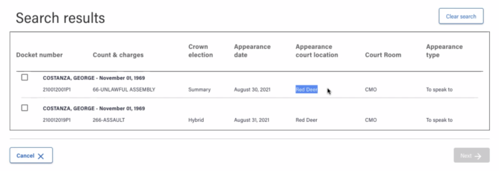
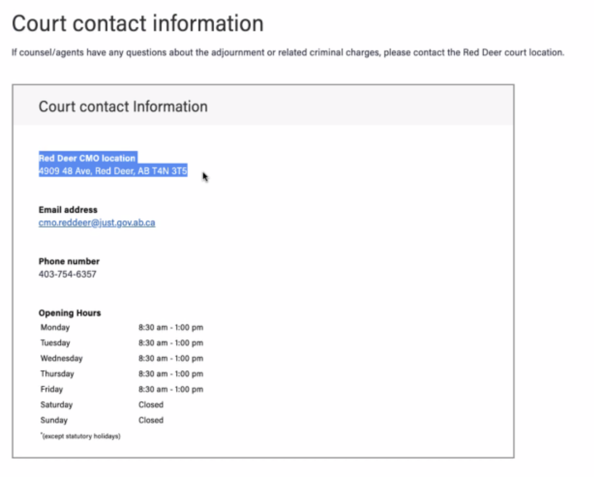
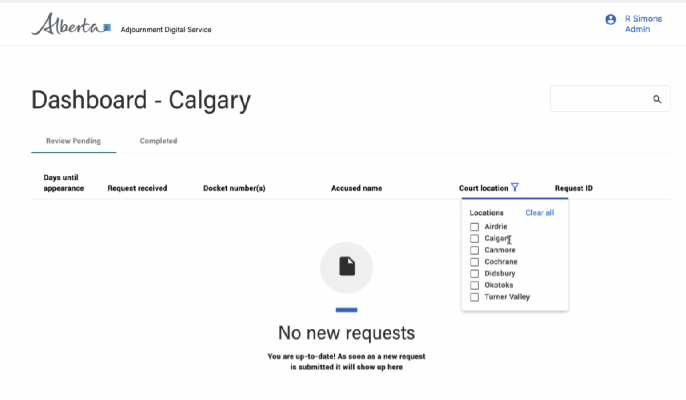

In development
{: .label .label-yellow }

# Find a court location
{: .no_toc .mt-8 .mb-5}

`court-locations-api`
{: .mt-2 .mb-5}
This shared-service helps your users find a court location.

[Swagger - API documentation](#)      [Health check](https://jdms-platform-api-jdms-dev.os99.gov.ab.ca/health-ui#/healthchecks)

---
## On this page
{: .no_toc .text-delta }

1. TOC
{:toc}
---

## Background
{: mb-3}
This API retrieves information for your service on:
- Courts
- Court IDs
- Divisions
- Courtrooms
- Circuit courts

Previously, there was no way to see all of the court information including all of the meta data for specific court locations.
---

## Using the shared service

### When to use
{: .no_toc .mb-3}
When you need to display court location information for the users within your service.

### How it works
{: .no_toc .mb-3}
This shared service compiles information on courts, court IDs, divisions, courtrooms, and circuit courts in a shared database.

### How to access
{: .no_toc .mb-3}

#### Testing environment
{: .no_toc .mb-2}
Access the dev environment to try out and test this shared service within your context and to determine if it fills your need.

[Try out and explore the API](#) (Link to Swagger page)

[Point to UAT endpoint](#)
 

#### Production access
{: .no_toc .mb-2}
To request access to the production environment: email your request to <JSG.PlatformSupport@gov.ab.ca>

---

## Examples

### How it’s used
{: .no_toc .mb-3}

**Adjournments digital service**

Stephen Nelson - digital architect

Rochelle Simons - service designer

[A description of how the action number generator is used within the Court Case Management digital service.]

**Filing digital service**

Ronald Garcia - Digital architect

Helen Maze - Product owner

[A description of how the action number generator is used within the Filing digital service.]

[link, video, or images of application]

---

### Additional documentation
{: .no_toc }
[Action number formatting](https://goa-dio.atlassian.net/wiki/spaces/QFR/pages/1486356612/Architecture+Artifacts#Action-Numbers)

---

## Support

### Need help? Connect with us on Slack
{: .no_toc }
[#jd-shared-services](https://justicedigital.slack.com/archives/C02UR7LPRDF) General information and discussion related to justice shared services including questions, new shared service proposals, contribution, and other requests.

You can also email the justice platform team at <JSG.PlatformSupport@gov.ab.ca>
