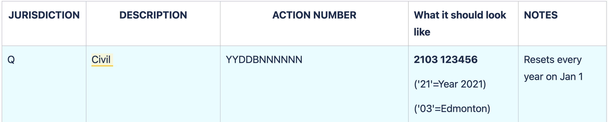

# Look up contact information for lawyers and law firms
{: .no_toc .mt-8 .mb-5}
`law-society-api`
{: .mt-2 .mb-5}
A directory to look up contact information for lawyers and law firms to use in your service.

[Swagger - API documentation](#)      [Health check](https://jdms-platform-api-jdms-dev.os99.gov.ab.ca/health-ui#/healthchecks)

---
## On this page
{: .no_toc .text-delta }

1. TOC
{:toc}
---

## Background
{: mb-3}
An [Action Number](https://twjeffery.github.io/DIO-test-2/docs/shared-service/Justice/glossary/#:~:text=Area-,Action%20number,-An%20Action%20Number) is a business key that is used to identify actions across all tracks in the Courts.

Action numbers are commonly a manual process, using paper and stamps. This service generates Action numbers automatically, automating the manual process and saving time, while eliminating duplicates of action numbers.

---

## Using the shared service

### When to use
{: .no_toc .mb-3}
Use the action number generator if you need to create a new action number for your service.

You would use this micro-service when you need to reliably generate an action number for a certain [jurisdiction](https://twjeffery.github.io/DIO-test-2/docs/shared-service/Justice/glossary/#:~:text=Justice-,Jurisdiction,-A%20jurisdiction%20is) and district or centre. The action number generator allows you to maintain a correct sequence for all action numbers created.

### When not to use
{: .no_toc .mb-3}
This service only creates action numbers for civil actions in the Court of Queen's Bench. It is not currently available in other levels of Court.

### How it works
{: .no_toc .mb-3}
Based on the jurisdiction and district, it will look up the last generated value in the sequence, and increment that. It then returns that identifier and formats it based on the business rules relevant for that jurisdiction and district.

The generator looks up the last action number, increments it, and returns the next one. Making sure there are no collisions.

### How to access
{: .no_toc .mb-3}
#### Testing environment
{: .no_toc .mb-2}
Access the dev environment to try out and test this shared service within your context and to determine if it fills your need.

[Try out and explore the API](#) (Link to Swagger page)

[Point to UAT endpoint](#)
 

#### Production access
{: .no_toc .mb-2}
To request access to the production environment: email your request to <JSG.PlatformSupport@gov.ab.ca>

---

## Examples

#### A Civil Action number explained:
{: .no_toc }

A [civil action](https://twjeffery.github.io/DIO-test-2/docs/shared-service/Justice/glossary/#:~:text=Justice-,Civil%20action,-A%20civil%20action) number is made up of Year, district, and number.

eg. Action Number 2103 123456 = (2021 Edmonton 123456)

See more [Action number rules and examples](https://goa-dio.atlassian.net/wiki/spaces/QFR/pages/1486356612/Architecture+Artifacts#Action-Numbers)

### How it’s used
{: .no_toc .mb-3}

**Court case management digital service**

Derek Osadiuk - Digital architect

Chrissy Parkinson - Product owner

[A description of how the action number generator is used within the Court Case Management digital service.]

[link, video, or images of application]

**Filing digital service**

Ronald Garcia - Digital architect

Helen Maze - Product owner

[A description of how the action number generator is used within the Filing digital service.]

[link, video, or images of application]

---

### Additional documentation
{: .no_toc }
[Action number formatting](https://goa-dio.atlassian.net/wiki/spaces/QFR/pages/1486356612/Architecture+Artifacts#Action-Numbers)

---

## Support

### Need help? Connect with us on Slack
{: .no_toc }
[#jd-shared-services](https://justicedigital.slack.com/archives/C02UR7LPRDF) General information and discussion related to justice shared services including questions, new shared service proposals, contribution, and other requests.

You can also email the justice platform team at <JSG.PlatformSupport@gov.ab.ca>
