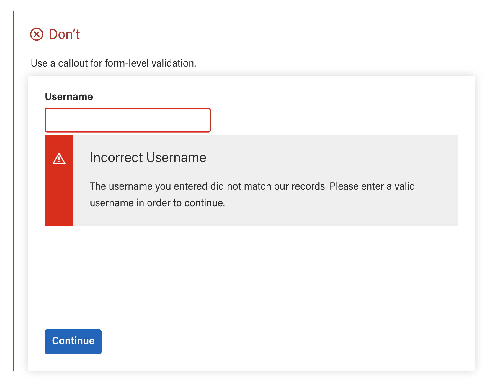
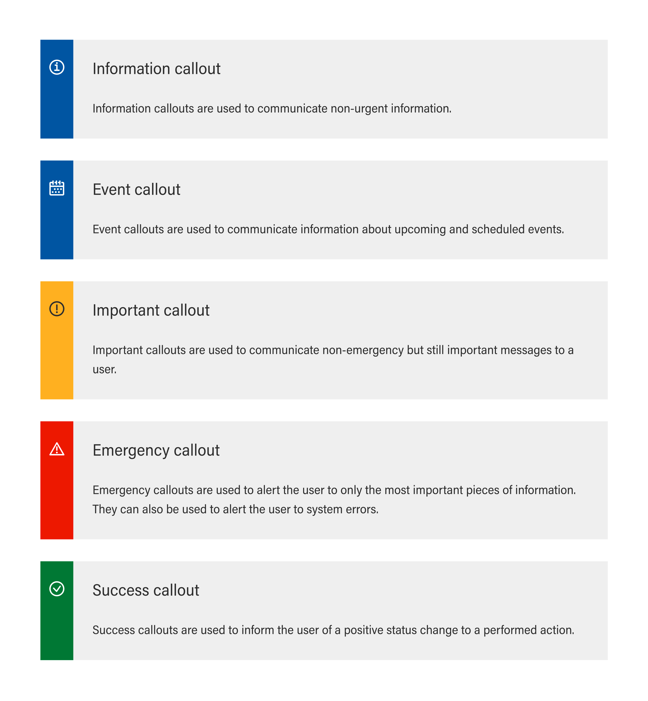
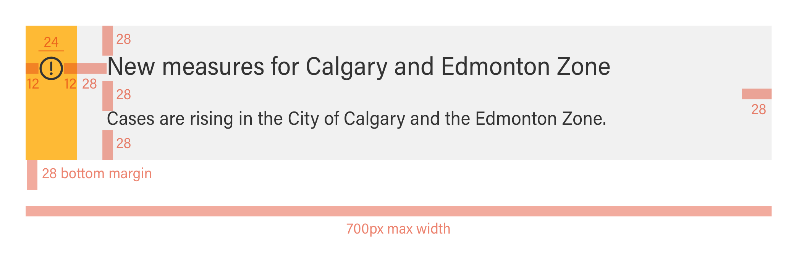

# Callout
{: .no_toc }

Callouts communicate important changes or facts within the body layout through a strong visual emphasis, so that users take notice and read the information.
<br><br>
**Usage** | [**Code**](https://twjeffery.github.io/DIO-test-2/docs/ui-components/callout-code/) | [**Related**](https://twjeffery.github.io/DIO-test-2/docs/ui-components/callout-related/)
<br><br>
{: .fs-6 .fw-300 }

## On this page
{: .no_toc .text-delta }

- TOC
{:toc}

---
<div>
<iframe
  width="100%"
  height="250"
src="https://ui-components.alpha.alberta.ca/react/iframe.html?id=react-components-callout--variants" markdown="block" />
</div>
```
<GoACallout
  type="'important || 'information' || 'event' || 'emergency' || 'success'"
  title="Callout Title"
  content="Information to the user goes in the content"
  <
/>
```
[**Angular**]() | [**React**]() | [**Vue**]() | [**Web components**]()
<br><br>


<br>

## Formatting
---

### Content
{: .no_toc }
Callout banners should communicate one piece of crucial information pertaining to the topic.

A callout banner must be relevant to the header or section to which it corresponds. In terms of importance within the section, it takes priority over any other paragraph under the header. If there is additional information that is not in the corresponding section, or is on another page, do use a link.

#### Container Text
{: .no_toc }
At minimum, body text is required. There may be an optional header.





### Variants
{: .no_toc }
Each calllout variant has a particular use case and its design communicates it's function to the user. It is therefore very important that the different variants are implemented consistently across products, so that they communicate consistently.
<br>


| Variant      | Purpose           |
|:-------------|:------------------|
| Information           | Information callouts are used to communicate non-urgent information. |
| Event | Event callouts are used to communicate information about upcoming and scheduled events.   |
| Important          | Important callouts are used to communicate non-emergency but still important messages to a user.      |
| Emergency           | Emergency callouts are used to alert the user to only the most important pieces of information. They can also be used to alert the user to system errors. |
| Success          | Success callouts are used to inform the user of a positive status change to a performed action. |


<br><br>

### Positioning
{: .no_toc }
Text

### Layout
{: .no_toc }
Text

### Anatomy and elements
{: .no_toc }



## Behaviors
---
Lorem ipsum dolor sit amet, consectetur adipiscing elit. Non vitae aliquet tincidunt sit nec nullam at. Tortor eget eleifend libero et adipiscing lectus. Egestas a arcu blandit aliquet consectetur nunc venenatis quis nisl. Dignissim tristique nulla fames senectus diam vitae.

### Breakpoint sizing
{: .no_toc }
text

## Accessibility
---
Lorem ipsum dolor sit amet, consectetur adipiscing elit. Non vitae aliquet tincidunt sit nec nullam at. Tortor eget eleifend libero et adipiscing lectus. Egestas a arcu blandit aliquet consectetur nunc venenatis quis nisl. Dignissim tristique nulla fames senectus diam vitae.

## Examples
---
Examples of this component used in context. Lorem ipsum dolor sit amet, consectetur adipiscing elit. Non vitae aliquet tincidunt sit nec nullam at. Tortor eget eleifend libero et adipiscing lectus. Egestas a arcu blandit aliquet consectetur nunc venenatis quis nisl. Dignissim tristique nulla fames senectus diam vitae.

---

## Feedback
---
Help improve this page. To help make sure that this page is useful, relevant and up to date, you can [share your research or feedback on Github](#) or propose a change below using _Edit this page._ [How to propose changes in Github](#)
