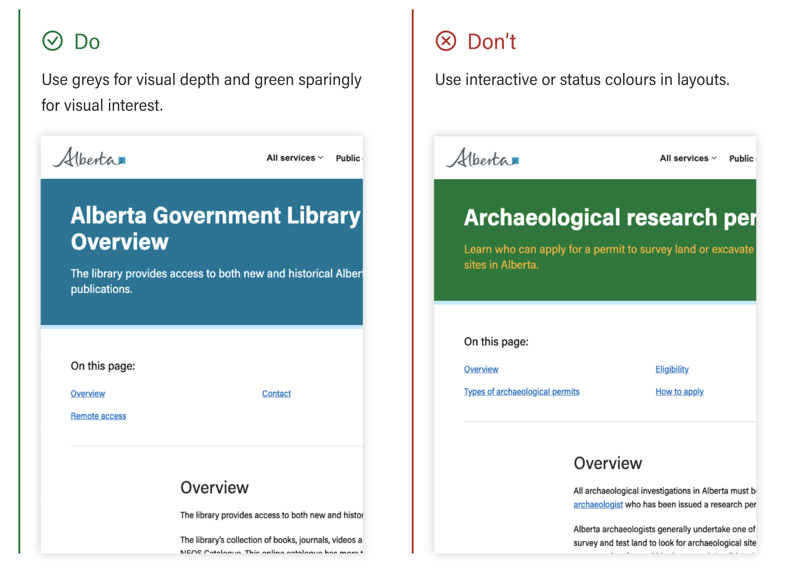
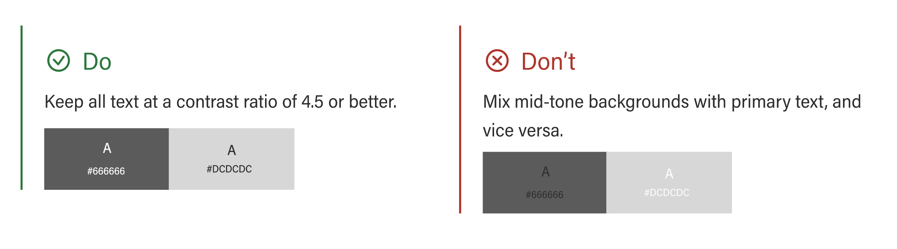
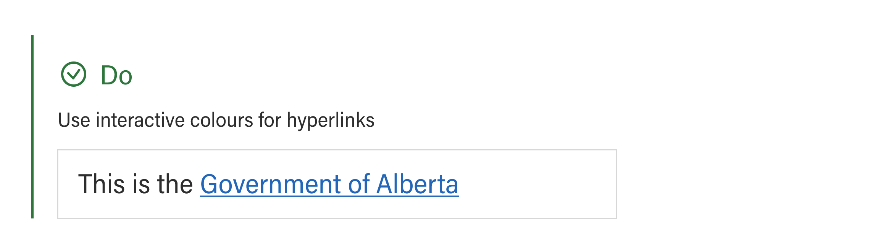
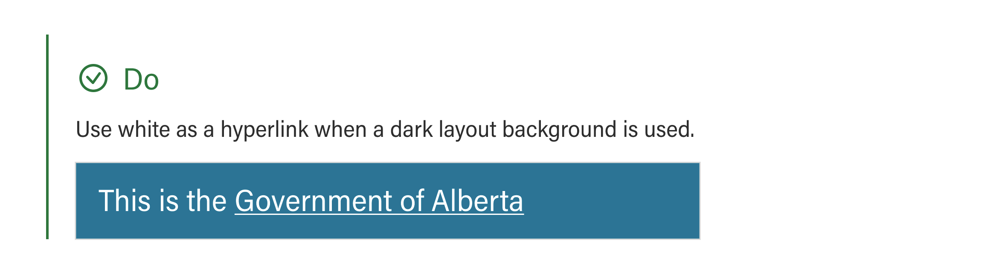
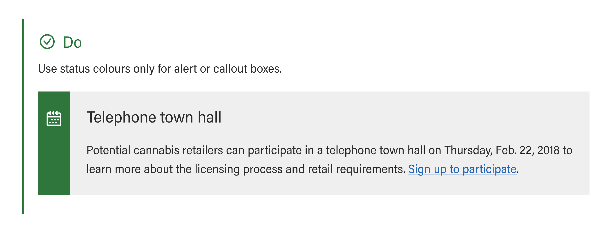
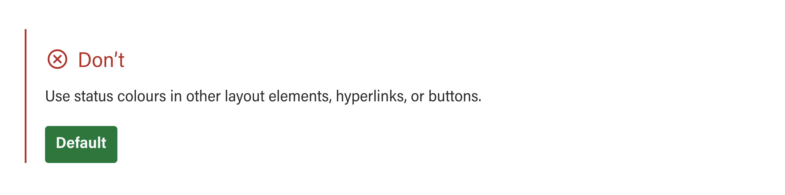

# Color
{: .no_toc }

The colour palette is accessible and derived from the government brand standards.
There are three primary types of colour groups: layout, interactive, and status.

## On this page
{: .no_toc .text-delta }

1. TOC
{:toc}

---

## Layout
Grey and white should make up the majority of a website, with blue interspersed for contrast and visual interest. These layout colours are used for depth, hierarchy, and grouping.

Layout colours are derived from the GoA Corporate Identity colours.
 

| Colour  | Colour name   | Hex code | SCSS variable | Notes |
|:---------------|:---------------------|:-------------------------|:-------------------------|:-------------------------|
|  | Primary-blue | #0081A2 |  `$primary-blue` | Default brand colour. |
|   | Dark-blue | #005072 | `$dark-blue` | Dark brand colour. |
|   | Light-blue | #C8EEFA | `$light-blue` | Light brand colour. |
|   | Black | #333333 | `$black` | Text colour. |
|   | White | #FFFFFF | `$white` | Text on primary buttons, dark backgrounds. |
 

 
### Accessibility
{: .no_toc }
In accordance with WCAG 2.0 standards, in order to maintain a contrast ratio of 4.5 for all text sizes, the following rules apply:
1. All of the dark and primary colour backgrounds are accessible with white text.
2. All of the mid-tones and light colour backgrounds are accessible with dark text.
 

 

## Interactive

Interactive colours are solely used for hyperlinks such as links and button elements. In the event that a dark background is used, however, the hyperlinks will be white.

Interactive colours are derived from tints of Alberta Blue.

| Colour  | Colour name   | Hex code | SCSS variable | Notes |
|:---------------|:---------------------|:-------------------------|:-------------------------|:-------------------------|
|  | Link | #0070C4 |  `$link` | Buttons and unvisited links. |
|  | Hover | #004F84 |  `$hover` | Button and link hover state. |

 
### Accessibility
{: .no_toc }
Interactive colour text is accessible on white or light backgrounds In accordance with WCAG 2.0 standards, in order to maintain a contrast ratio of 4.5 for all text sizes.
 
## Grey

| Colour  | Colour name   | Hex code | SCSS variable | Notes |
|:---------------|:---------------------|:-------------------------|:-------------------------|:-------------------------|
|  | Dark-grey | #666666 |  `$dark-grey` | Secondary text. |
|  | Grey | #ADADAD |  `$grey` | Grey. |
|  | Mid-light-grey | #DCDCDC |  `$mid-light-grey` | Borders. |
|  | Light-grey | #F1F1F1 |  `$light-grey` | Light background. |
 
## Status

There are four status colours, these colours are used exclusively for alert or callout boxes. Status colours are derived from official Provincial and Flag colours.

| Colour  | Colour name   | Hex code | SCSS variable | Notes |
|:---------------|:---------------------|:-------------------------|:-------------------------|:-------------------------|
|  | Status-info | #005DAA |  `$status-info` | Information status. |
|  | Status-success | #00853F |  `$status-success` | Success status. |
|  | Status-warning | #FEBA35 |  `$status-warning` | Warning status. |
|  | Status-emergency | #EC040B |  `$status-emergency` | Emergency status. |
 

### Accessibility
{: .no_toc }
All text on status backgrounds with the exception of yellow must be white, in accordance with WCAG 2.0 standards, in order to maintain a contrast ratio of 4.5 for all text sizes.
